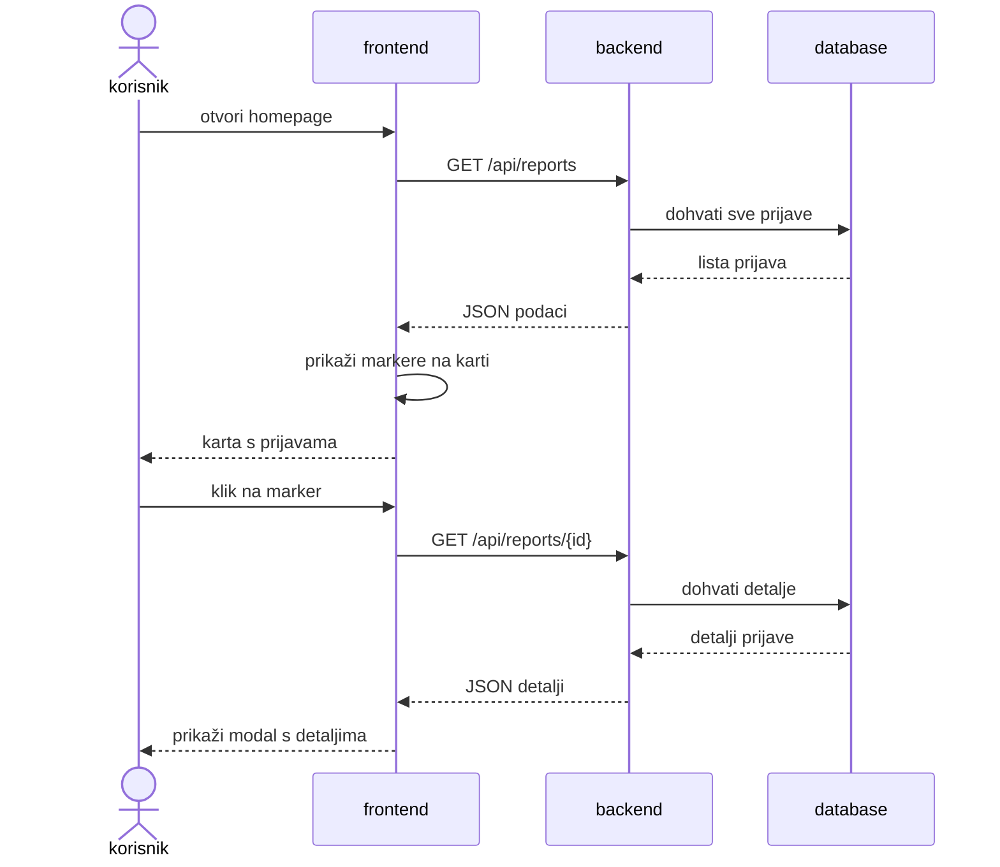
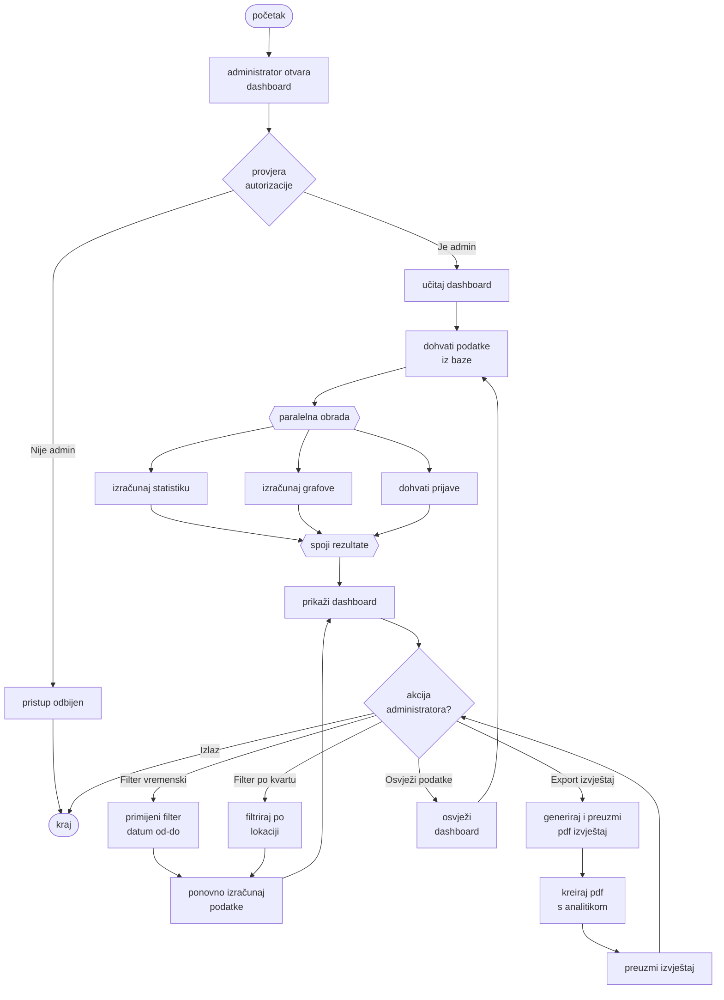
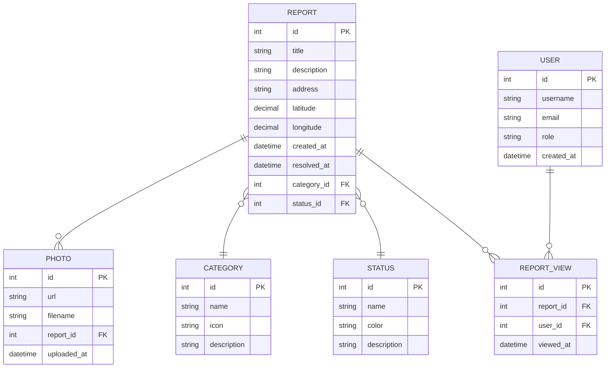
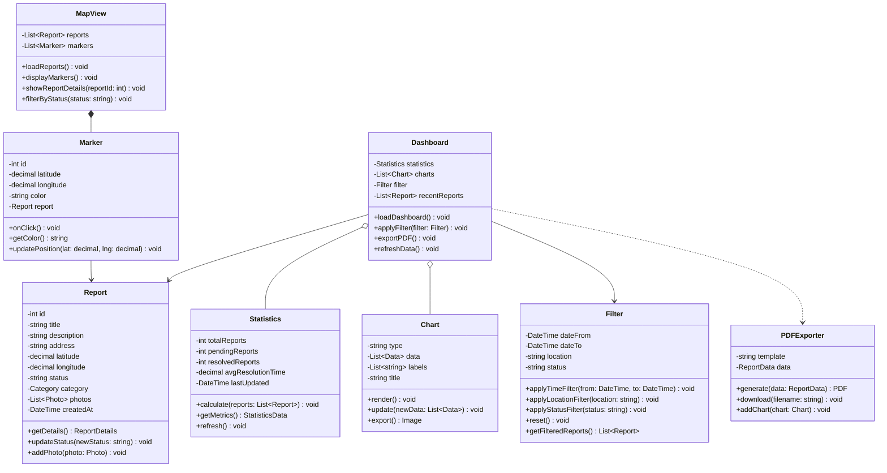

# MODUL 4 - FUNKCIONALNOSTI

## Opis modula

Modul 4 se sastoji od homepage-a sa kartom i dashboard-a za administratore. Svi korisnici mogu vidjeti prijave na karti, a admini imaju pristup statistici i analizi podataka. Modul pokazuje gdje su problemi na karti i daje pregled koliko ih ima i kako se rješavaju.

---

## Funkcionalnosti

<AccordionGroup>
  <Accordion title="1. Učitavanje stranice s kartom grada">
    Aplikacija dohvaća sve prijave iz baze i stavlja ih na kartu kao markere.
  </Accordion>

  <Accordion title="2. Prikaz markera na karti">
    Markeri se prikazuju na lokaciji gdje je problem prijavljen. Boja markera ovisi o tome je li problem nov, u obradi ili riješen.
  </Accordion>

  <Accordion title="3. Detalji problema">
    Kada korisnik klikne na marker otvara se prozor sa svim detaljima. Tu se vidi fotografija problema, opis, adresa i status.
  </Accordion>

  <Accordion title="4. Provjera autorizacije">
    Dashboard mogu otvoriti samo admini i zaposlenici u gradu, ostali nemaju pristup.
  </Accordion>

  <Accordion title="5. Učitavanje podataka za dashboard">
    Sustav istovremeno izračunava statistiku, pravi grafove i dohvaća najnovije prijave.
  </Accordion>

  <Accordion title="6. Prikaz glavnih metrika">
    Na vrhu dashboard-a prikazuju se ukupno prijava, koliko ih čeka, koliko je riješeno i prosječno vrijeme rješavanja.
  </Accordion>

  <Accordion title="7. Analitički grafovi">
    Grafovi pokazuju stanje prijava kroz vrijeme i koje kategorije su najčešće.
  </Accordion>

  <Accordion title="8. Filtriranje po datumu">
    Admin može odabrati period i vidjeti samo prijave iz tog vremena.
  </Accordion>

  <Accordion title="9. Filtriranje po kvartu">
    Moguće je odabrati područje i vidjeti statistiku samo za taj dio grada.
  </Accordion>

  <Accordion title="10. Preuzimanje izvještaja">
    Admin može preuzeti izvještaj u PDF formatu sa svim podacima i grafovima za sastanke.
  </Accordion>
</AccordionGroup>

---

## Dijagrami

### Sekvencijski dijagram - Homepage s kartom

Prikazuje interakciju između korisnika, frontend-a, backend-a i baze podataka pri učitavanju homepage-a s kartom prijava.

### Activity dijagram - Dashboard za administratore

Prikazuje tok rada i logiku dashboard-a za administratore, uključujući autorizaciju, učitavanje podataka i dostupne akcije.

### ER Dijagram - Struktura baze podataka

### Class Dijagram - Struktura aplikacije

